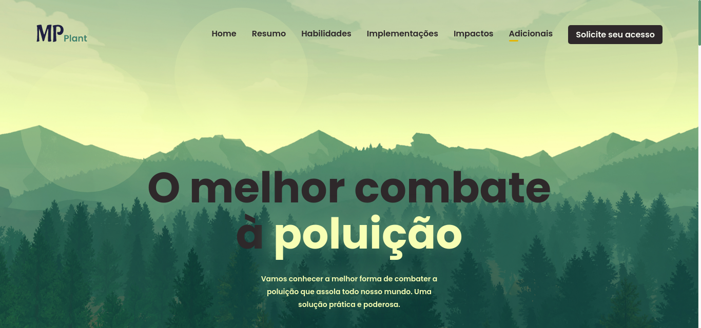

<p align="center">
    <a href="#-projeto">🖥 Projeto</a>&nbsp;&nbsp;&nbsp;|&nbsp;&nbsp;&nbsp;
    <a href="#-tecnologias">👨‍💻 Tecnologias</a>&nbsp;&nbsp;&nbsp;|&nbsp;&nbsp;&nbsp;
    <a href="#-executar-o-projeto">🖇 Execução do Projeto</a>&nbsp;&nbsp;&nbsp;|&nbsp;&nbsp;&nbsp;
    <a href="#-licença">📃 Licença</a>&nbsp;&nbsp;&nbsp;|&nbsp;&nbsp;&nbsp;
    <a href="#-observações">📌 Observações</a>
</p>
<div style="display: flex; flex-direction: row; justify-content: center; align-items: center; flex-wrap: wrap"  align="center">
    
</div>


## 🖥 Projeto
O **MP plant** é um projeto desenvolvido como desafio promovido por estudantes da Start Se, para fazer networking entre os alunos e desafiar desde os mais iniciantes, até os avançados.

## 👨‍💻 Tecnologias
As tecnologias usadas nesse projeto foram:
- [HTML]('https://developer.mozilla.org/en-US/docs/Web/HTML')
- [CSS]('https://developer.mozilla.org/en-US/docs/Web/CSS')
- [JS]('https://developer.mozilla.org/en-US/docs/Web/Javascript')

## 🖇 Executar o Projeto
Para executar o projeto, siga dos seguintes passos:

- Clone o repositório
    ```bash
    $ git clone https://github.com/Yta-ux/mp_plant.git
    ```
- Entre no repositório e pronto, já é possível manipular os arquivos
    ```bash
    $ cd mp_plant/
    ```
 
##  📃 Licença
Esse projeto possui licença MIT. Para mais detalhes consulte o arquivo [LICENSE](LICENSE.md)


## 📌 Observações
- Projeto está responsivo; 
